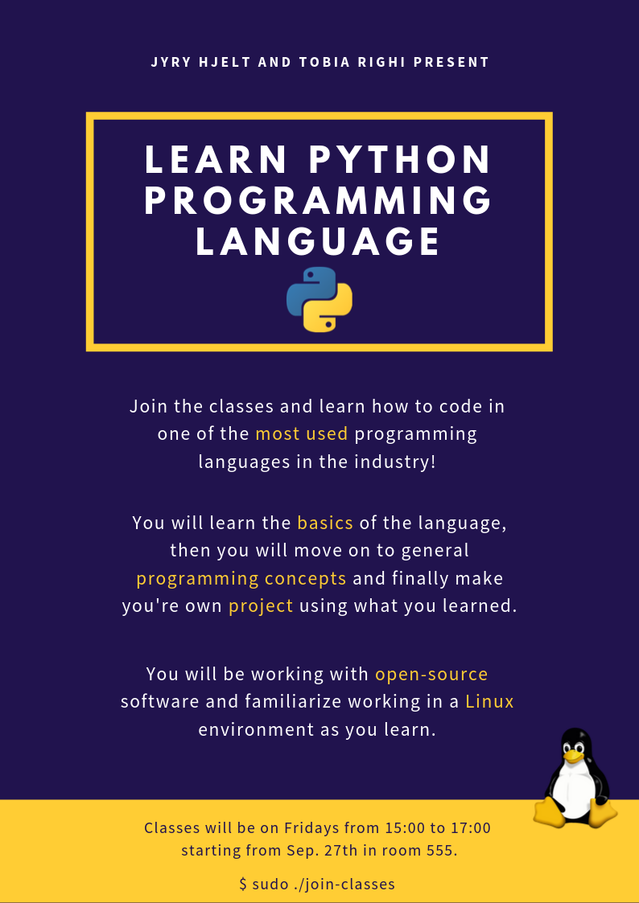

# Python Course
This repository contains all the course material used for the python course
by Tobia Righi and Jyry Hjelt

You can find the course material in the folder `src/`, you can view that here,
or if you prefer a pdf version you can find it under `pdfs/`.

Feel free to create an Issue if you have any questions or if you
would like a particular topic covered.

Here is our course plan:
1) Basic syntax, I/O and arithmetic operators
2) Boolean arithmetic and control flow
3) Functions and objects
4) Complex data structures
5) Starting with more complex things (will not be covered in a specific amount of lectures):
    - Errors and exceptions
    - Libraries
    - Interaction with the system
    - Threads
6) Real life applications of Python, one library will be chosen from: 
    - Numpy and Matplotlib
    - Pygame
    - Flask
    - BeautifulSoup

